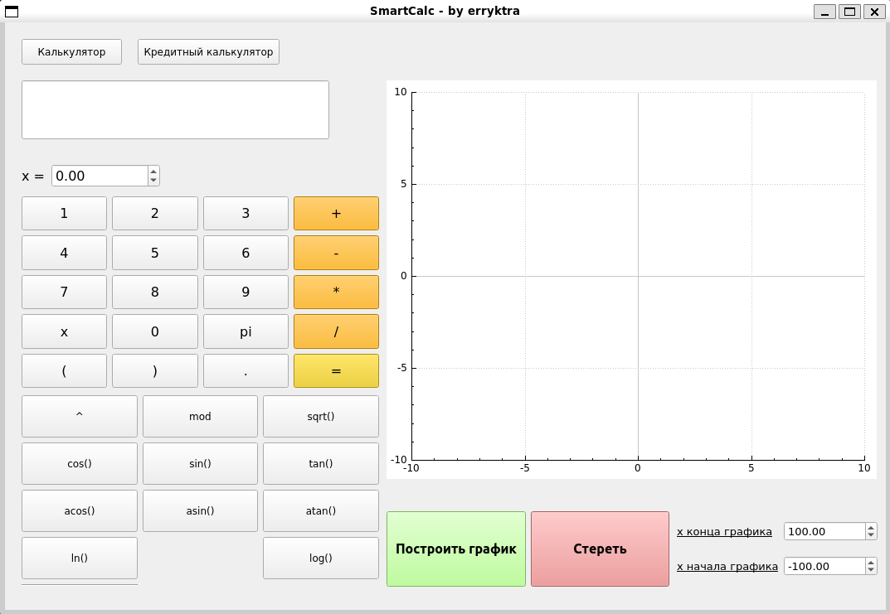
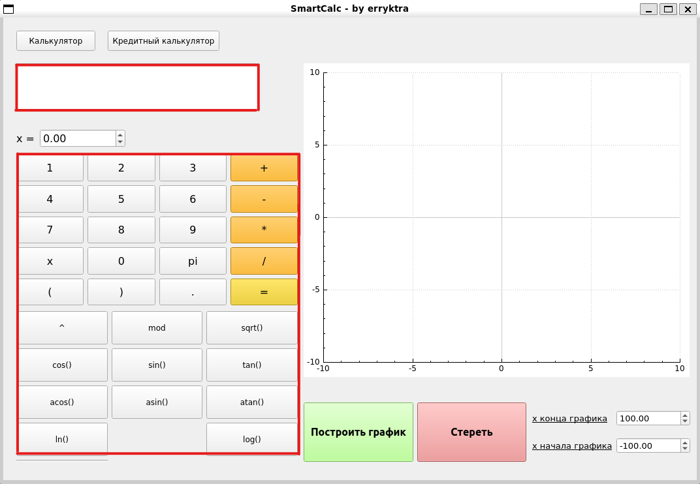
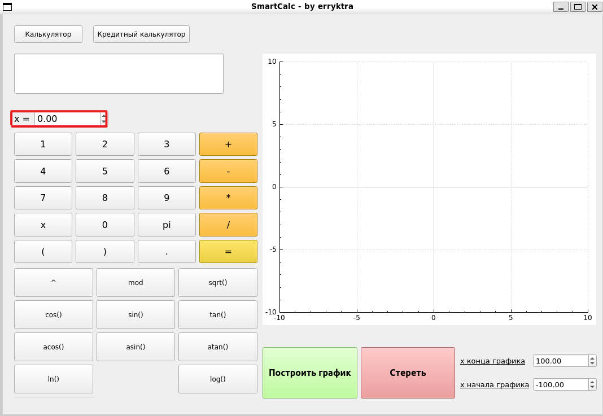
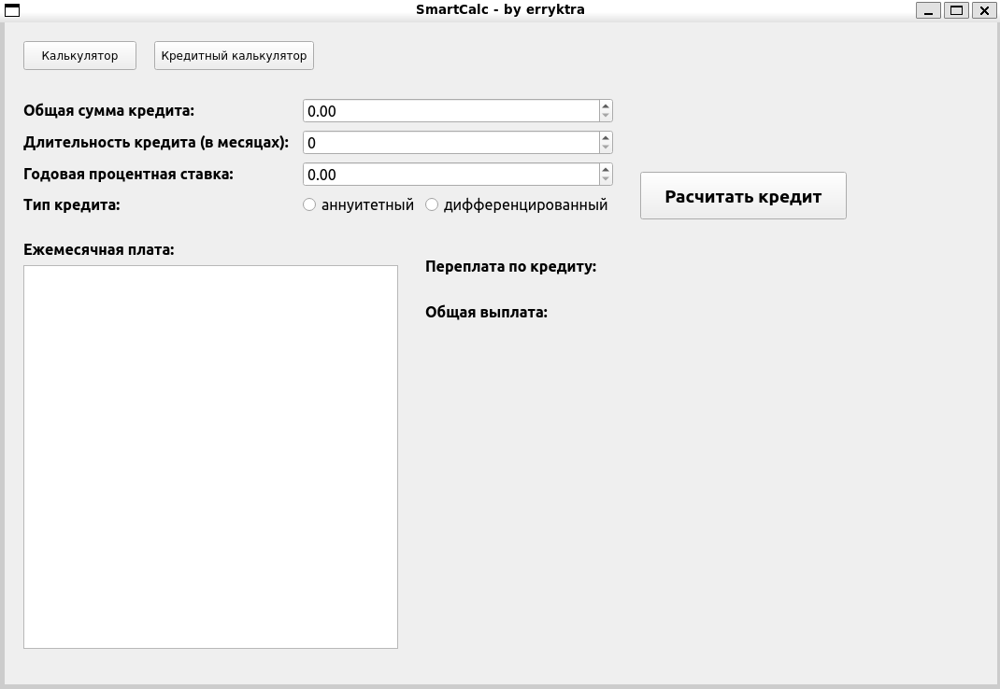

# Добро пожаловать в SmartCalc 1.0
## Это руководство пользователя

### Оглавление
0. [Общие положения](#Общие-положения)
1. [SmartCalc 1.0](#smartcalc)
2. [Кредитный Калькулятор](#кредитный-калькулятор)

## Общие положения
В начале работы интерфейс должен выглядеть следующим образом:

Все числа вводятся в десятичной системе счисления арабскими цифрами. Для выделения дробной части используется точка - «.».

## SmartCalc
В белое поле ввода вы можете вводить значения как вручную (с клавиатуры), так и с помощью кнопок калькулятора:

Примечание: для ввода некоторых значений необходимо с помощью мыши переставлять курсор. \
Данные кнопки выполняют следующие действия:
*  « = » калькулятор производит вычисления
* «Построить график» происходит построение графика в заданых координатах (см. «х конца/начала графика»)
* «Стереть» полностью очищает данные в поле ввода выражения и на координатной сетке
* кнопки 1-9, x, pi, +, -, * и др. добавляют в поле ввода значения, изображённые на кнопке
* «Калькулятор» показывает окно с обычным калькулятором
* «Кредитный калькулятор» открывает окно с кредитным калькулятором (подробнее см. раздел Кредитный Калькулятор)

## Основные правила составления выражений
1. Любой унарный - или + должен быть обрамлён круглыми скобками. Также допустимо использование унарных - и + в начале выражения. Например: 
    * -2+3 
    * cos(-1/pi) \
    Недопустимо: 
    * 2----4
    * tan(+-+-pi)
2. Для умножения числа на любое выражение, заканчивающееся закрывающейся круглой скобкой, необходимо использовать *. Например: \
    2.1 (78-4)*5\
    2.2 sin(x)*34-3
3. В выражении может присутсвовать «x» или «pi». К ним применяются те же правила, что и к числам. В качестве «х» может быть подставлено любое значение, введенное в данное окошко (см изображение). При построении графика значение, введёное в данное окно не учитывается. 

Для изменения значений «x» в полях ввода можно использовать либо клавиатуру, либо стрелочки, находящиеся справа от поля ввода. Принимаются десятичные числа.

## Кредитный Калькулятор
Для перехода в кредитный калькулятор необходимо нажать кнопку «Кредитный калькулятор» вверху экрана. При удачном переходе вы увидите следующее окно:

В поле «Общая сумма кредита» необходимо ввести ту сумму *в рублях*, на которую Вы взяли кредит.\
В поле «Длительность кредита» необходимо ввести количество *месяцев*, на которое Вы взяли кредит.\
В поле «Годовая процентная ставка» необходимо ввести годовую ставку *в процентах*, под которую Вы взяли кредит.\
С помощью переключателя нужно выбрать какой у Вас тип кредита.

Как только всё будет настроено, нажимаете «Расчитать кредит». В белом поле будут выведены платежи на каждый месяц, а рядом с надписями «Переплата по кредиту:» и «Общая выплата» появятся соотвествующие суммы. В случае необходимости у Вас появится ползунок, который позволит пролистнуть вниз и увидеть следующие выплаты

## Дополнение
В случае любой ошибки просто появляется сообщение «Произошла ошибка». В случае претензий, пожеланий и простого эелания пообщаяться пишите в телеграм @Well_Duke. \
◄◄◄ Калькулятор был создан пиром erryktra в 2023-2024 годах. ►►► \
(* w *)